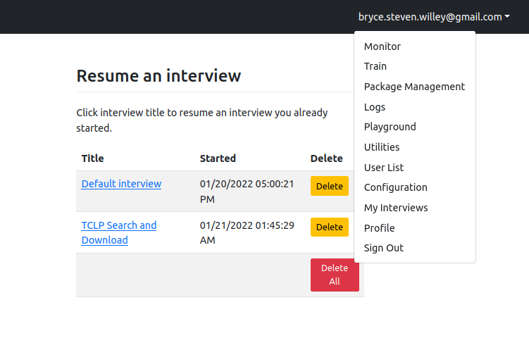

# docassemble.tclpgoogledocsmerger

A docassemble extension that helps a user search for docs in a Google Drive based on tags / metadata.

Made in association with The [Chancery Lane Project](https://chancerylaneproject.org/)

Special dependencies:
* a branch of [docxcompose](https://github.com/BryceStevenWilley/docxcompose/tree/master), version `1.3.5-devlemma`.
  * this branch merges a [standing PR](https://github.com/4teamwork/docxcompose/pull/58) that works when certain styles aren't present
  * also fixes some issues with [abstractNumId uniqueness](https://github.com/BryceStevenWilley/docxcompose/commit/a90e445857dbf61ce5c999bb50b13291b51d7b12)
* a branch of [docxtpl](https://github.com/LemmaLegalConsulting/docxtpl/tree/subdoc_bookmark_issues)
  * this branch fixed an issue where bookmark ids were only renumbered per subdocument, not over the whole document
* a branch of [docassemble that supports optgroups](https://github.com/BryceStevenWilley/docassemble/tree/optgroups)
  * also includes a [PR that prevents DA from crashing on newer versions of docxtpl](https://github.com/jhpyle/docassemble/pull/504), which the previous branch includes

## Airtable Config

This interview uses the data in [an Airtable](https://airtable.com/shr5ITqr8fOECQthj/tblZduZJJkNz9tbzY), to
determine which clause applies to a particular query.

In your docassemble configuration, you should add the following YAML dictionary, replacing the example values on the right with your Airtable information:

```yaml
docs airtable:
  api key: keyabcDEF12345678
  base id: appabcDEF12345678
  table name: "Grid View"
```

If there are issues connecting to the Airtable, those issues will be
printed in the [docassemble logs](https://docassemble.org/docs/admin.html#logs).

## Refreshing the Airtable Data Source.

If Airtable is down or you haven't configured Airtable correctly, this interview will use a CSV backup of the information in the airtable, saved in this repository.

In the rare case that you need to update, you will need to do two things: setting up a way to modify the installed interview on a server, and
actually updating the CSV file. The first step only needs to be done once, per user per server.

### Modifying an installed interview

1. Login to your server. You should have at least developer privileges.
2. Go to the playground (click your email on the top right of the screen to reveal a drop down, then click on "Playground").
  
3. Once in the playground, you need to pull the latest version of the code from Github. Click "Folders > packages", then "Pull".
  

  

4. There, enter the information of this github repo:
  * github url: https://github.com/LemmaLegalConsulting/docassemble-tclpgoogledocsmerger
  * branch: main
  Press pull.
  
5. Press back (top left of the screen) until you are at the playground screen again.

### Updating the CSV file.

1. Go to the [Airtable with the clause data](https://airtable.com/shr5ITqr8fOECQthj/tblZduZJJkNz9tbzY).
2. Press "download as CSV", hidden behind the three dots. Save the CSV file on your computer as `Grid_view.csv`.
  
3. Go back to your playground on the docassemble server.
4. In the playground, go to "Folders > Sources".
  
5. On the sources page, upload the `Grid_view.csv` file by pressing "Browse..." and then "Upload".
  
6. Press back (top left) to go back to the playground. Then go to "Folders > packages".
  
7. (optional) on this screen, you can update the version. This allows you to easily know what version of the Airtable document
  is being used in production. Change the version to anything you like. The default looks like 1.2.3, but you can add text as well, i.e.
  1.2.3-march-data. Change this version number and press save at the bottom of the screen.
8. Press "Install" at the bottom of the screen. This will cause the server to restart, so avoid updating during peak traffic times.

## Adding new Clauses

Once a clause is present in the Airtable data (see above), you can add its corresponding DOCX to the Google Drive folder, and it will be found and downloaded by this interview. It's important that the name of the DOCX in the Drive folder have the exact name of the clause somewhere in it, with the same spelling as in the Airtable. Otherwise, it won't be found and downloaded by this interview (ignoring `&` and `'`). For example, if the DOCX's name is "Gilbert _ Sullivan_s Clause - V3", and the Airtable "Child name" is "Gilbert & Sullivan's Clause", that's okay. But if the DOCX's name is "Chris_s Clause - V4" and the Airtable name is "Chris' Clause", it won't be found.

For some reason, the documents that we have been starting with have 10's to 100's of DOCX validation errors. These documents will generally open okay in Word or Google Docs on their own, but these validation errors cause problems when working with the open source libraries that we use to combine
the documents. The easiest way to prevent these validation errors from causing problems is to just
remove them from the original documents. That process is described below:

1. Download the document from Google Drive or other cloud editor and open locally with Desktop Word (works with Word 2019, but later versions probably should too).
2. Go to File > Save As, and save the file as a Rich Text Format (.rtf), and close Word.
3. Open the newly saved .rtf file in Word. Go to File > Save As, and now save as a Word Document (DOCX). Make sure that the "Maintain compatibility with previous versions of Word" is checked.
4. (optional) Sometimes, this process causes Word to make the background style of the tables in the document orange. To change this back to a normal white background, move your cursor into the table, and click on the "Design" tab above the ribbon. You should see the orange background in the "Table Styles". Delete it (right click > delete table style) from the document, and click on the desired table style. Save the document.
5. Upload the corrected DOCX files to the Google Drive folder that this interview is using.

## Authors

Bryce Willey, Quinten Steenhuis

